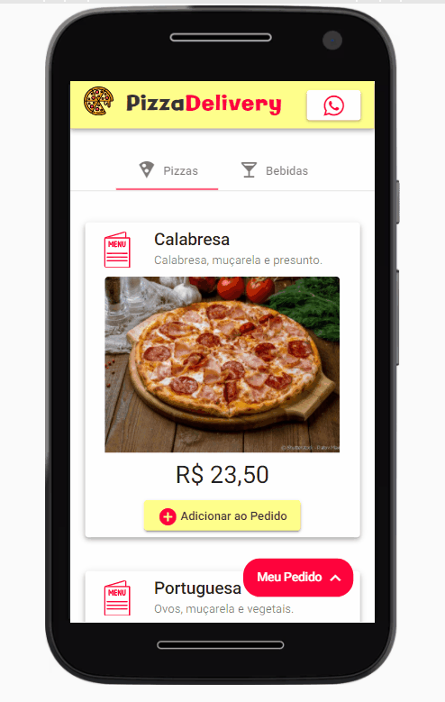
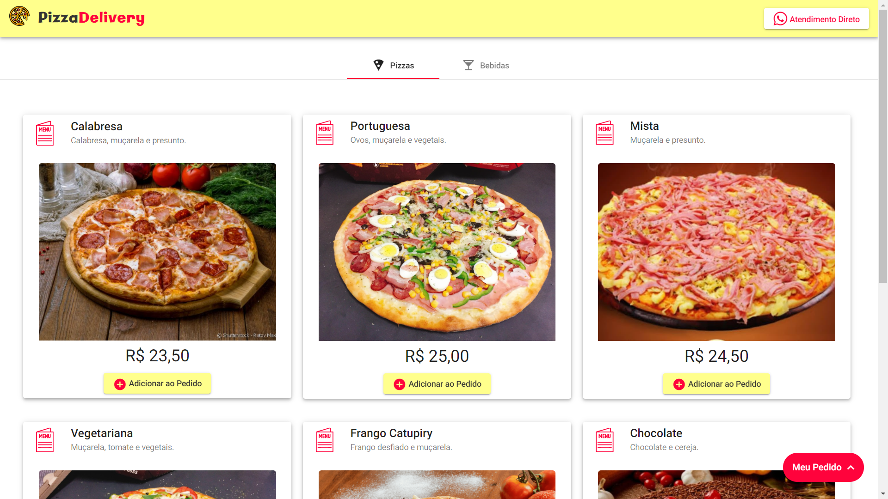

<h1>
  

    DubaiPizzaria
  

</h1>

  </img>

  
Aplicação de delivery para pizzarias, feita em Angular!

## :hammer: **Tecnologias Usadas** :wrench:
  
  
  
  
  

## :sparkles: **Novas Funcionalidades** :sparkles:
- Adição de **opção de meia pizza** no pedido, permitindo a escolha de dois sabores.
- Remoção do botão de busca, simplificando a interface do usuário.
- Atualização dos componentes de **pedido**, incluindo novas funcionalidades para adicionar e visualizar as opções de bebidas.
- Integração de imagens locais das bebidas no serviço de produtos.

## :iphone: Mobile

</img>
  
## :desktop_computer: Desktop

</img>

Este projeto foi gerado com [Angular CLI](https://github.com/angular/angular-cli) version 11.0.3.

